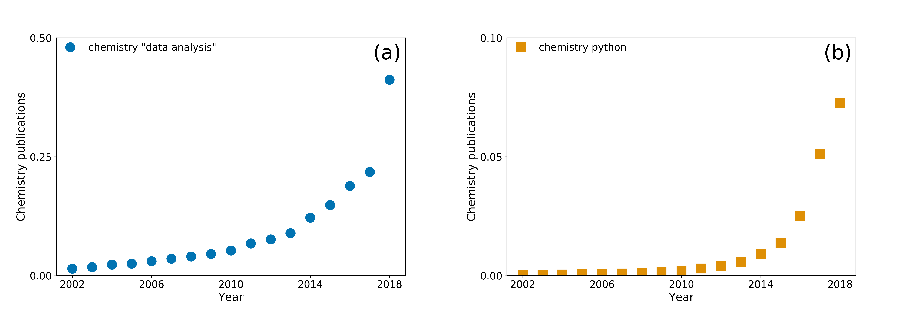

# Summary

This paper describes the open educational resource (OER) developed at the University of Bath, within the pythoninchemistry project (http://pythoninchemistry.org), to introduce undergraduate chemistry students to Python programming and programmatic data analysis.
The OER consists of five tutorials, designed to give students a quick (applied in a three hour slot) introduction to programming and, hopefully, show the utility of programmatic data analysis.

# Statement of Need

The number of chemistry publications which mention "data analysis" or "python" is increasing at an exponential rate (Figure 1), and therefore it is necessary to make courses that introduce such topics available to undergraduate students.
In order to achieve this, the University of Bath began the pythoninchemistry project, designed to bring Python instruction into every year of the chemistry undergraduate program.
This OER is the first introduction that many first year undergraduate chemistry students received to programming, and is run in the first academic semester to the students degree.
We introduce many aspects of basic programming and data analysis within the content of the course; mathematical operations, data types, modules, plotting, etc.
We believe that this offers the students a strong introduction to programming, and hope that it will improve future engagement in data analysis focused laboratory exercise throughout their degree.

*Figure 1. The percentage of chemistry publication that mention (a) data analysis or (b) python. Determined from Google Scholar search results.*

Since the introduction, this module has been successful at the University of Bath, running for three years (as of 2019).
Furthermore, it has also be accessed my many users from outside the chemistry degree cohort, as a useful introduction to programming, as aspects being taken to other Universities with similar ambitions for more computationally literate chemistry graduates. 

# Usage

This course is designed to be a, mostly, self-guided, interactive exercise that may be used to introduce students of chemistry (at any level) to programming in Python and using Jupyter notebooks for data analysis.
The University of Bath applies this course as a three hour laboratory session, where the first year undergraduate chemistry students are able to work through the material in their own time with assistance from the laboratory demonstrating staff (consisting of PhD students).

The course begins with an introduction to the Jupyter notebook graphical user interface, details why students should be interested in analysing data programmatically, and explain the `assert` functionality that is used in course assessment.
The second tutorial gives the students an introduction to simple mathematical operations using Python.
The `math` module is then shown to explain how more complex operations may be performed, such as `sqrt`, before going on to discuss the concept of variables a way of sorting data.
Tutorial three discusses data types, including the introduction of lists and the `numpy` array (as well as the `numpy` module more generally).
The `matplotlib` library is then shown, and basic trigonometric functions are plotted.
Finally, some basic statistical operations that are available to `numpy` and `scipy`, such as averages and linear regression are introduced.

We feel that this course equips the students well to apply the data analysis skills later in their chemistry degree programs.
This is reinforced with a later exercise that introduces functions and allows for the application to chemically-relevant problems.
Furthermore, the skills that have been introduced my also be applied in the analysis of later laboratory exercises that may be encountered in a typical chemistry degree program.

# Author Contributions

B.J.M. developed the course with input from F.D.
B.J.M., F.D., and A.R.M. wrote the paper.

# Acknowledgements

B.J.M. acknowledges support from the Royal Society (Grant No. UF130329).
A.R.M. is grateful to the university of Bath and Diamond Light Source for co-funding a studentship (Studentship Number STU0149).

# References
